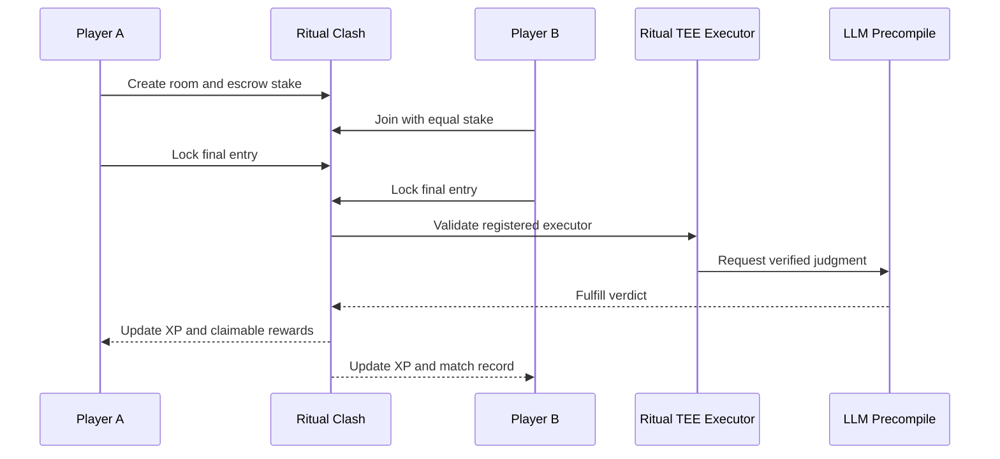

<div align="center">

# Ritual Clash

**Competitive AI games settled on-chain by verified Ritual infrastructure.**

[](https://github.com/chtokko/ritual-clash/actions/workflows/ci.yml)
[](contracts/evm/VerdictArenaRitual.sol)
[](https://explorer.ritualfoundation.org)
[](LICENSE)

</div>

Ritual Clash is a fully on-chain competitive game protocol. Two players lock their entries and optional native RITUAL wagers, then a TEE-verified Ritual LLM executor settles the match through the smart contract.

There is no required backend, database, relayer, bot, or webhook. Profiles, rooms, submissions, results, XP, standings, and claimable rewards live directly on Ritual Chain.

## Live deployment

| Resource | Value |
| --- | --- |
| Network | Ritual Chain |
| Chain ID | `1979` |
| RPC | `https://rpc.ritualfoundation.org` |
| Arena contract | [`0x1eB4...deE8`](https://explorer.ritualfoundation.org/address/0x1eB4A8374ba2cE8F7668ecCfE2814E3cB2b8deE8) |
| Explorer | [explorer.ritualfoundation.org](https://explorer.ritualfoundation.org) |

## Game modes

- **Argue** - the clearer and better-supported argument wins.
- **Bluff** - the most persuasive bluff wins, independently of factual truth.
- **Prompt Duel** - the prompt most likely to reproduce the target wins.

## Protocol flow



If Ritual returns an execution error, the room remains ready for a safe retry. Stakes are not discarded.

## Technology

- React 18, TypeScript, Vite, and Tailwind CSS
- Reown AppKit, Wagmi, Viem, and TanStack Query
- Solidity 0.8.26, Hardhat, Ethers, and Chai
- Ritual TEE Service Registry, RitualWallet, AsyncJobTracker, and LLM precompile

## Quick start

Requirements: Node.js 18 or newer and pnpm 10.

```bash
git clone https://github.com/chtokko/ritual-clash.git
cd ritual-clash
pnpm install --frozen-lockfile
cp .env.example .env.local
pnpm dev
```

On Windows PowerShell, replace the copy command with:

```powershell
Copy-Item .env.example .env.local
```

The development server uses port `8080` by default. Pass another port when needed:

```bash
pnpm dev -- --port 8081
```

## Configuration

```dotenv
# Public frontend configuration
VITE_REOWN_PROJECT_ID=
VITE_RITUAL_CLASH_CONTRACT_ADDRESS=0x1eB4A8374ba2cE8F7668ecCfE2814E3cB2b8deE8

# Deployment only - never expose this key through a VITE_* variable
RITUAL_RPC_URL=https://rpc.ritualfoundation.org
RITUAL_PRIVATE_KEY=0xYOUR_PRIVATE_KEY

# Source verification
RITUAL_VERIFIER_URL=https://rpc.ritualfoundation.org/api/verify
```

Local environment files are ignored by Git. Never commit a private key.

## Commands

| Command | Purpose |
| --- | --- |
| `pnpm dev` | Start the Vite development server |
| `pnpm lint` | Run source-quality checks |
| `pnpm typecheck` | Validate TypeScript |
| `pnpm test` | Run the Solidity contract suite |
| `pnpm build` | Build the production frontend |
| `pnpm check` | Run the complete verification pipeline |
| `pnpm preflight:ritual` | Verify Ritual system contracts |
| `pnpm estimate:ritual` | Estimate deployment gas and affordability |
| `pnpm deploy:ritual` | Deploy a new arena contract to Ritual |

## Repository structure

```text
contracts/evm/                 Ritual arena contract and local mocks
deploy/                        Ritual deployment script
docs/ritual-architecture.md    Protocol architecture and system addresses
scripts/                       Deployment estimate and network preflight
src/                           React application
test/evm/                      Hardhat contract tests
```

## Security

- Every supplied executor is validated against Ritual's TEE registry.
- Handles, topics, and submissions have explicit byte limits.
- Entries become immutable after submission.
- Settlement errors preserve the room and wager for retry.
- Rewards use pull payments and a withdrawal lock.
- Public reads do not require a wallet; signatures are required for state changes.

See [the architecture document](docs/ritual-architecture.md) for the contract flow and system addresses. Security reports should follow [SECURITY.md](SECURITY.md).

## Contributing

Contributions are welcome. Read [CONTRIBUTING.md](CONTRIBUTING.md) before opening a pull request. Every change must pass `pnpm check`.

## License

Released under the [MIT License](LICENSE).
